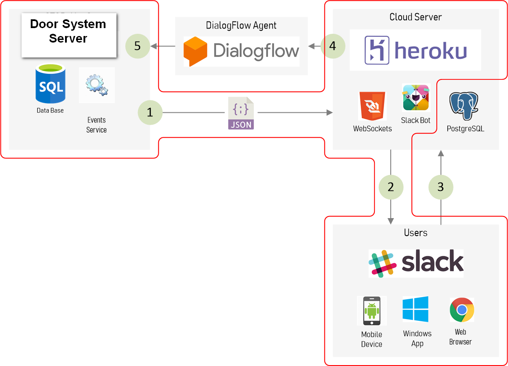
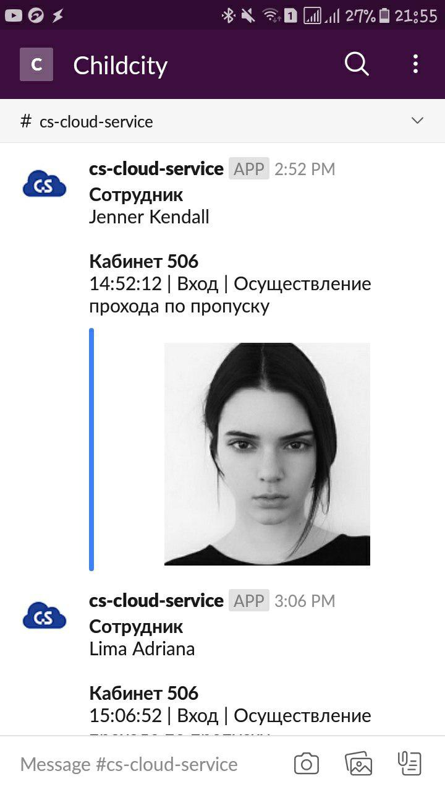
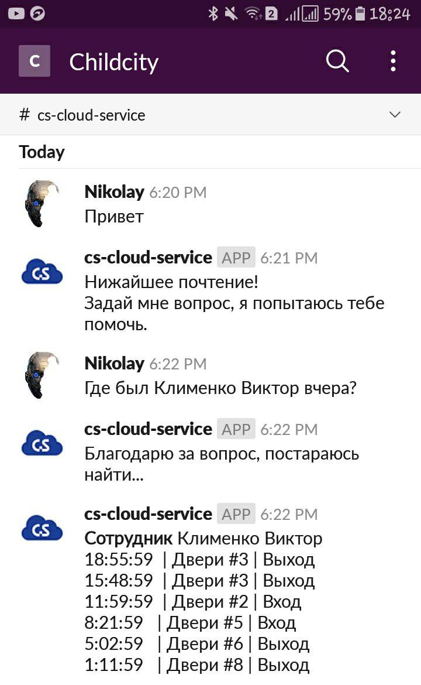
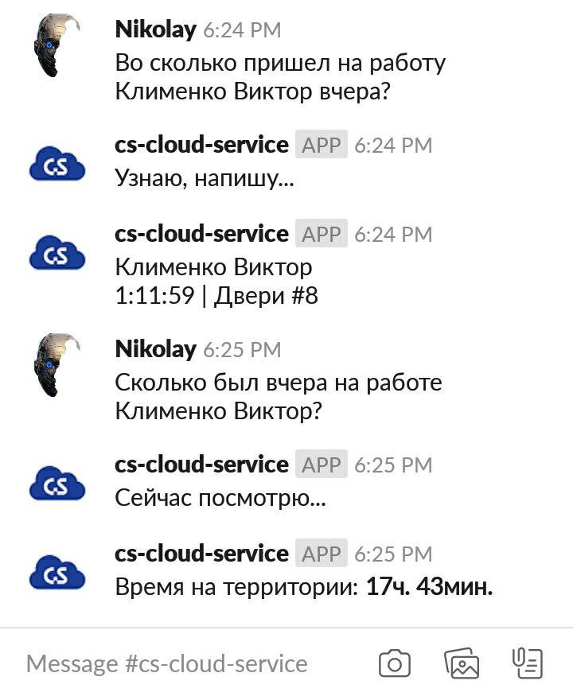

# CS_EventsNotifierSlackBot
Bot for Slack, which can receive new notification from [Client](https://github.com/Childcity/CS_EventsServer) by WebSocket and then send it to [Slack](https://slack.com) chat.

From chat you can interect with Door System by asking questions, 
which process [DialogFlow](https://dialogflow.com/) and sends webhook with 
fields of user query to provided URL.

## How it works

## Example of event from ChatBot in [Slack](https://slack.com) channel

## Example of Dialog with ChatBot in [Slack](https://slack.com) channel

